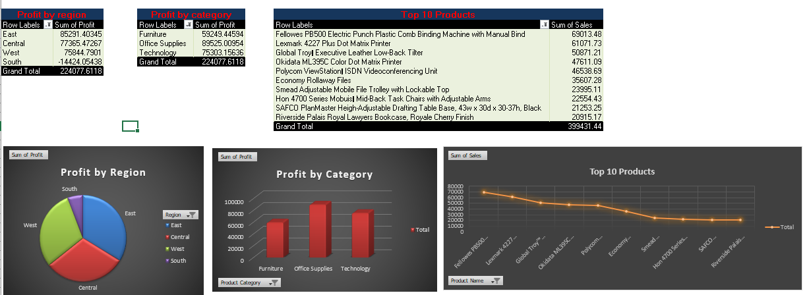

# Superstore Sales Analysis in Excel

This project demonstrates how Microsoft Excel can be used for **data cleaning, visualization, and dashboard creation**.  
It highlights advanced Excel features such as **PivotTables, charts, conditional formatting, data validation, and lookup functions**.

---

## 📂 Dataset
- **Source**: Superstore Sales dataset (publicly available on Kaggle/GitHub)
- **Fields**: Order Date, Ship Date, Region, Category, Product Name, Sales, Profit, Quantity, Discount

---

## 🛠 Features
  - Conditional Formatting (highlighting products with sale above 5000,negative profit)
  - Data Validation (restricting entries for Region)
  - Lookup Functions (LOOKUP)
  - Mathematical functions(MAX,MIN,LARGE)

---

## 📊 Dashboard Preview

---

## ✨ Key Insights
- **East region** generated the highest profit overall.
- **Office Supplies category** had strong profit.
- **Top 10 products** contributed disproportionately to total sales.

---

## 📌 About
Created by **Rose U T** to showcase Excel data analytics skills.  
This project is part of a growing portfolio that will later include **Power BI** and **Python** projects.
